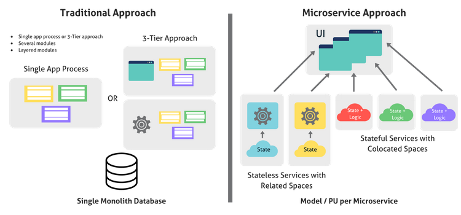

# Cloud Computing 
**Cloud computing** is the delivery of different services through the Internet. These resources include tools and applications like data storage, servers, databases, networking, and software. 

The four pillars of DevOps
- Automation 
- Robustnusness
- Speed 
- Flexibility/Ease of Use

These principles can easily be utilised using cloud computing. 

# N-tier Architechure
n-tier Architecture divides app into (n) number of layers that have specific responsiiblitys and independent of each other.

- Monolith 
Simple, portable and esy to manage
No scalibily 
Not using re4source efficiently 

- 2-tier Architechure 
Client/Server architecture
Aplication/Data Tiers 
Some resource effecirncy 
Some scalibility and flexibility
Some failover 

- 3-tier architecture
Presention/GUI Tier
Logic/application tier
Data tier

- Microservices Architecture 
An architectural style that structures an application as a collection of services that are. Highly maintainable and testable. Loosely coupled. Independently deployable. Organized around business capabilities.

# AWS
AWS stands for Amazon Web Services. It is a huge set of hardware and services that we can use to build an infrastructure for our app. It's pretty enormous and can do hundreds of things.

We will be using it to create virtual machines that match our dev environment. But these virtual machines will be live to the world. It is definitely not the only service that we could use and you will see many others as well.

# Launch an instance

1. **Sign-in**

Sign-up and login into your console using the details provided by the instructor. 

2. **Launching an instance**

Click on the `Services` tab at the top of the homepage and choose `EC2`. On the EC2 page click the `Launch Instance` button.

What is EC2**

3. **Choose an Amazon Machine Image(AMI)**
An AMI is a template that contains the software configuration (operating system, application server, and applications) required to launch your instance. You can select an AMI provided by AWS, our user community, or the AWS Marketplace; or you can select one of your own AMIs.
 
Next we choose the operating system, `Ubuntu Server 16.04 LTS (HVM), SSD Volume Type (64-bit)`

4. **Choose an Instance Type**
Amazon EC2 provides a wide selection of instance types optimized to fit different use cases. Instances are virtual servers that can run applications. They have varying combinations of CPU, memory, storage, and networking capacity, and give you the flexibility to choose the appropriate mix of resources for your applications. 

The next step is to choose the power of the machine. How many CPUs do we need and how much RAM. This time we will choose the  `t2.micro` option as it is more than sufficient for our needs. 

5. **Add Storage**
Your instance will be launched with the following storage device settings. You can attach additional EBS volumes and instance store volumes to your instance, or edit the settings of the root volume. You can also attach additional EBS volumes after launching an instance, but not instance store volumes.

**For now we will skip this step**

6. **Add Tags**
A tag consists of a case-sensitive key-value pair. For example, you could define a tag with key = Name and value = Webserver.A copy of a tag can be applied to volumes, instances or both.

We will fill in 'KEY' as `Name` and 'Value' as `eng89_yourname`

7. **Configure Security Group**
A security group is a set of firewall rules that control the traffic for your instance. On this page, you can add rules to allow specific traffic to reach your instance. For example, if you want to set up a web server and allow Internet traffic to reach your instance, add rules that allow unrestricted access to the HTTP and HTTPS ports.

- Add a `SSH` port to access the sever with an ssh key: for my use only 
- Add a `HTTP` to access your ip address: for global access
- Add a `Custom TCP` to access port 3000 for out nodeapp: for global access

8.  **Launch**
A summary of the server settings will appear, review then click `Launch`.

Select an existing key pair `eng89_devops` and click `Launch instances`

# SSH into the Machine 

- Seect your ec2 server and select `Connect` 
- Copy the commands on the `SSH Client` page into your terminal 
- Copy the public ip into your browser and you should see the correct page, in opur case the nginx page. 
